# EMBERVALE — A Fox Tale

A complete Zelda-like action-adventure that runs in your browser. No installs, no
dependencies — pure HTML5 Canvas + Web Audio, all art and music generated from code.

You are **Rua**, a fox swordsman. The **Gloom Knight** has stolen the **Verdant
Crown**, and Embervale's forests are withering. Find the Elder, take up the blade,
brave the Hollow Ruins, and bring the crown home.

> **About this project:** Embervale is inspired by the classic *The Legend of
> Zelda* games (screen-by-screen overworld, sword-and-heart combat, item-gated
> dungeon design). It was built entirely by an AI model — Claude, by Anthropic —
> as an experiment to test how far AI models can go in designing and shipping a
> complete game: original pixel art, original chiptune compositions, world design,
> enemy AI, and a finishable quest, all written as code in a single session.
> No game assets were used; every sprite, tile, and song is generated from text.

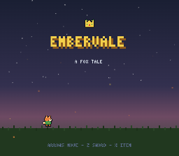

## How to run

Option A — just open the file:

1. Open the folder where you cloned or downloaded this repository.
2. Double-click **`index.html`**. It opens in your default browser and the game
   starts at the title screen.

Option B — local server (recommended, avoids any browser file restrictions):

1. Open a terminal (PowerShell on Windows, Terminal on macOS/Linux).
2. Go to the folder where you cloned this repository:
   ```
   cd path\to\Embervale
   ```
3. Start a server:
   ```
   python -m http.server 8321
   ```
4. Open your browser and go to: `http://localhost:8321`

## Controls

| Key | Action |
| --- | --- |
| Arrow keys / WASD | Move |
| Z or Space | Sword · talk · read signs · open |
| X | Use equipped item (bow / bombs) |
| Enter | Pause + inventory (select item with arrows, Z to equip) |
| M | Mute / unmute |

## Screenshots

| | |
| --- | --- |
| 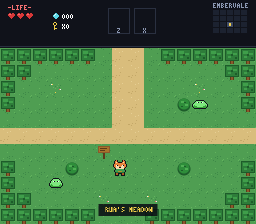 | 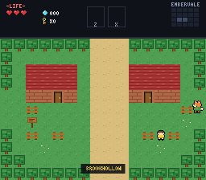 |
| Rua's Meadow — where the journey begins | Brookhollow village |
| 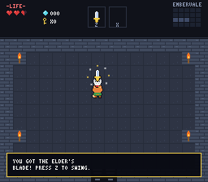 | 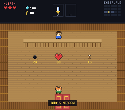 |
| The Elder's blade | The village shop |
| 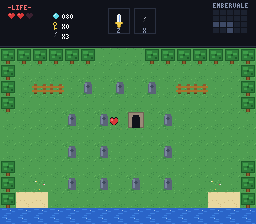 | 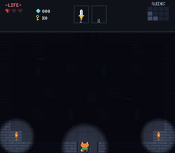 |
| A bomb reveals the crypt | Dark halls of the Hollow Ruins |
| 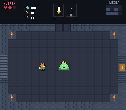 | 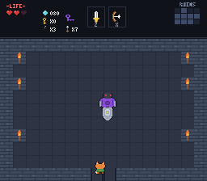 |
| The Royal Slime guards the Fern Bow | The Gloom Knight |
| 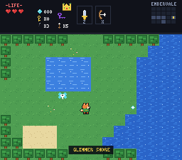 | 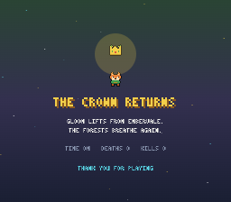 |
| Glimmer Shore's healing fairy | The crown returns |

## The quest

- Visit the **Elder** in the cave west of Brookhollow village — he'll give you a sword.
- Bushes hide gems. Gems buy **bombs**, **arrows**, and a **heart vessel** at the shop.
- The **Hollow Ruins** lie north of the crossroads: 12 rooms of skeletons, ghosts,
  shutter-gate ambushes, dark halls (find the **Lantern**), small keys, the
  **Fern Bow** (guarded by the Royal Slime), the **Gloom Key**, and the
  **Gloom Knight** himself — his shield blocks swords, but arrows pierce the gloom.
- Secrets: bombable cracked rock hides treasure caves, a fairy spring heals you,
  and a full-health sword fires beams.

The game saves automatically (browser localStorage). Dying costs nothing but pride —
your gear stays with you.

## Tech

- `js/sprites.js` — every sprite is text-encoded pixel art with auto-outlining; the
  tile atlas is drawn procedurally; 3×5 bitmap font.
- `js/audio.js` — a chiptune tracker (square/triangle/noise channels) playing seven
  original compositions, plus ~30 synthesized sound effects.
- `js/world.js` — 20 hand-authored overworld screens, a 12-room dungeon,
  6 interiors, NPCs and dialog (validated at boot).
- `js/entities.js` — player, 7 enemy types, a miniboss and a 2-phase boss,
  projectiles, particles.
- `js/game.js` — fixed-timestep loop, screen-scroll transitions, dynamic lighting,
  HUD with minimap, shop, save system.

`tools/shot_server.py` is a development helper (captures gameplay screenshots) and
is not needed to play.
